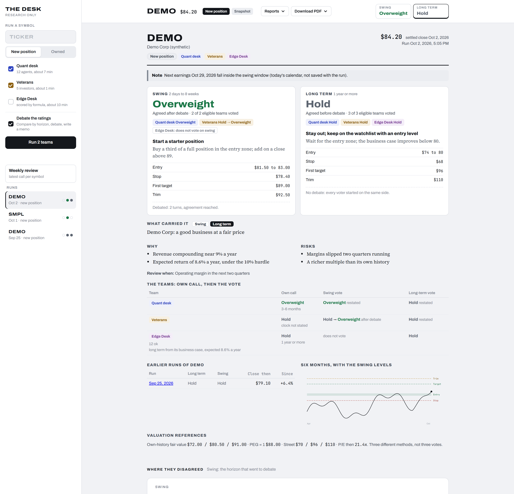
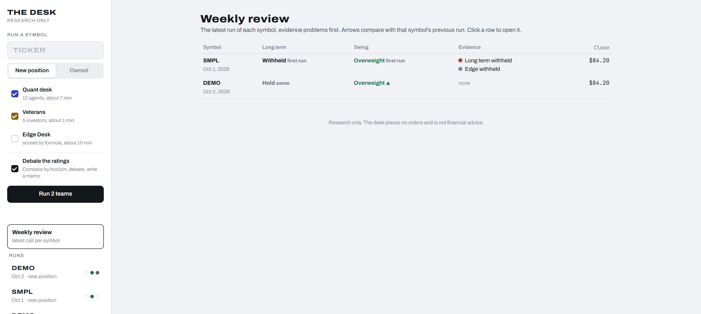
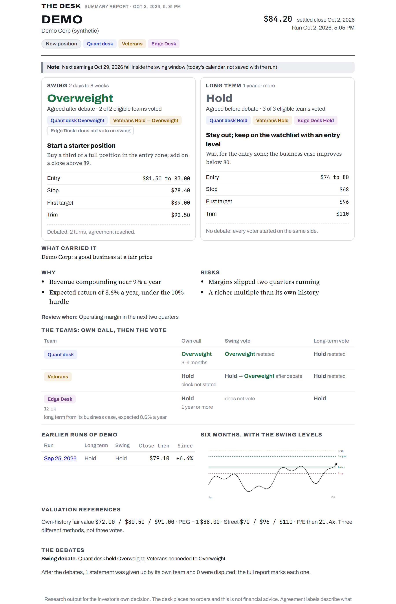

# ai-research-desk

[](https://github.com/simonro/ai-research-desk/actions/workflows/ci.yml)
[](https://github.com/simonro/ai-research-desk/releases/latest)
[](LICENSE)

A research desk for one stock at a time. Three independent AI research teams study the same
company, a desk manager compares their calls for two holding periods (swing, 2 days to 8 weeks,
and long term, 1 year or more), the teams debate where they disagree, and you get a short memo
with a rating, the action for your position, price levels and the reasons. It is for people who
pick their own stocks and want a second, third and fourth opinion that shows its work.

- **It runs on your own AI plan, not an API bill.** Model calls go through your Claude plan (the
  `claude` CLI) or your ChatGPT plan (the `codex` CLI). No per-call charges.
- **Numbers come from code, not from a model.** Prices, valuation, levels and the data checks are
  computed. Models write arguments and memos, and figures they quote are checked against the evidence.
- **It refuses rather than guesses.** Stale filings withhold the long-term rating for the whole desk,
  a missing figure is unknown rather than zero, and a failed step is shown as failed.
- **Research only.** It never places an order or connects to a brokerage account.
- **Free and MIT licensed.** No paid tier, no account, no telemetry.

**[Quick start](#quick-start)** · **[Releases](https://github.com/simonro/ai-research-desk/releases)** · **[Privacy](#privacy-and-your-data)**

**What this is not:** not financial advice, not a signal service, and not a validated model. The
ratings have not been shown to beat the market. Every screenshot below is synthetic demo data for
fictitious companies, not anyone's real research or positions.



## Privacy and your data

ai-research-desk runs on your own computer. It needs no account, sends no telemetry, and the
dashboard listens on `localhost` only.

### What stays local

- Every run: the teams' reports, the debate, the memo and the PDF, saved in `memos/`.
- Which stocks you research and whether you own them.
- Your settings and keys, in `~/.hedge-desk/.env`.

### External services

**Your AI plan (Anthropic for Claude, OpenAI for ChatGPT)**: receives the prompts, which contain
the ticker, prices, filings figures, headlines and the teams' reports. It never receives your keys
or whether you own the stock (ownership is applied in code after the analysis). Every call runs with
no tools, no web search, no file access and none of your personal CLI settings.

**Alpaca (optional)**: receives the tickers you run, to return prices, splits and news headlines.
Without Alpaca keys, prices come from **Yahoo Finance**, which receives the tickers.

**SEC EDGAR**: receives the tickers and the contact string you set in `SEC_USER_AGENT`, which SEC
requires. It returns the companies' filings.

### API keys

Keys live in `~/.hedge-desk/.env` on your machine, which is never committed. Do not share or commit
`.env` files, login folders, run memos or screenshots with personal details.

## What's inside

- **Three research teams**: [TradingAgents](https://github.com/TauricResearch/TradingAgents)
  (analysts, a bull and bear debate, a trader and risk managers),
  [ai-hedge-fund](https://github.com/virattt/ai-hedge-fund) (investor personas over SEC filings
  with a research manager), and Edge Desk (a point-in-time evidence package, a deterministic
  business case and factor screen, then a written analysis).
- **The desk manager**: restates each team's call for each horizon from its own report only, sends
  disagreements to a debate where a manager defends or concedes (never a compromise), fact-checks
  what did not survive, and writes the memo. A 2 against 1 standoff is reported as gridlock, not
  decided for you.
- **Data checks**: one settled close for every team, a stale-filing rule, unknown values kept unknown.
- **The dashboard**: start a run, watch the teams work live, reopen any past run, a weekly review of
  the latest call per symbol, and a two-page PDF summary.

## Screenshots

**The call.** Both horizons side by side, with the action for your position, levels, who voted, how
it was decided, the reasons and risks, earlier runs of the same symbol and the chart.


**Weekly review.** The latest call per symbol, evidence problems first, with arrows against the
previous run. Here a stale filing has withheld one company's long-term rating.



**The PDF summary.** Two pages: the same first screen and the debates in a few lines.



## Quick start

Requirements: [Python 3.12](https://www.python.org/downloads/) (ai-hedge-fund needs numpy 1.x,
which has no wheels for newer Python on Windows), [git](https://git-scm.com/), and the CLI for your
plan: [Claude Code](https://docs.claude.com/en/docs/claude-code) (`claude`) for a Claude plan, or the
[Codex CLI](https://github.com/openai/codex) (`codex`) for a ChatGPT plan.

**Windows, two steps:** clone the repo with `git clone --recurse-submodules`, then double-click

1. `setup.bat`, once. It builds one environment per part and creates `~/.hedge-desk/.env`.
2. `launch.bat`, every time. Then open http://localhost:8790

**Manual setup (Mac, Linux, or if you prefer):**

```bash
git clone --recurse-submodules https://github.com/simonro/ai-research-desk
cd ai-research-desk
python3.12 install.py
# edit ~/.hedge-desk/.env: set SEC_USER_AGENT, and Alpaca keys if you have them
claude                      # log in once, if you use a Claude plan
scripts/run-dashboard.sh    # then open http://localhost:8790
```

Every install starts empty: no runs and no demo data. Type a ticker in the dashboard, pick the
teams, and start a run. A run with all three teams and a debate takes about 15 to 30 minutes.

### Using a ChatGPT plan

Set `DESK_PLAN=chatgpt` in `~/.hedge-desk/.env`, then log the desk in to your ChatGPT plan once. The
desk keeps its own Codex login, separate from any you already use, so your personal Codex settings
never reach the analysis:

```bash
# PowerShell
$env:CODEX_HOME="$HOME\.hedge-desk\codex"; New-Item -ItemType Directory -Force $env:CODEX_HOME | Out-Null; codex login
# Mac or Linux
mkdir -p ~/.hedge-desk/codex && CODEX_HOME=~/.hedge-desk/codex codex login
```

One plan per run: a run is all Claude or all ChatGPT, and the memo records which.

## Updating to a new release

Your runs (`memos/`) and your settings (`~/.hedge-desk/.env`) are not part of a release, so an
update never touches them.

**If you cloned with git:** `git pull`, `git submodule update`, then `setup.bat` (or
`python3.12 install.py`) if dependencies changed.

**If you downloaded the ZIP:** unzip the new version into a new folder, copy `memos/` across, and
run the setup once.

## Configuration

All settings live in `~/.hedge-desk/.env`; `.env.example` documents every one.

| Variable | Enables |
|---|---|
| `DESK_PLAN` | `claude` (default) or `chatgpt` |
| `SEC_USER_AGENT` | Required. Your name and email, which SEC asks for |
| `ALPACA_API_KEY`, `ALPACA_SECRET_KEY` | Alpaca prices and news (free accounts work). Without them prices come from Yahoo and there is no news |
| `DESK_CHATGPT_STRONG`, `DESK_CHATGPT_FAST` | The ChatGPT models for the manager and analyst roles |
| `TRADINGAGENTS_*`, `HEDGE_FUND_*`, `EDGE_DESK_MODEL` | The Claude models each team uses |
| `FRED_API_KEY` | Macro data for TradingAgents (free) |
| `DESK_VAULT_DIR` | Also save each memo as a note in a markdown vault such as Obsidian |
| `DESK_MEMOS_DIR` | Where runs are saved (default `memos/`) |

From the command line: `scripts/run-desk.sh MSFT --own --engines quant,vets,edge` (`.bat` on
Windows). `--own MSFT` marks it as a position you hold; a bare `--own` treats every ticker as new.

## How far to trust it

Large language model ratings cannot be backtested honestly: the models have seen the period being
tested. So the desk is forward-tested only, and nothing here has been shown to predict returns. Edge
Desk prints what has been measured about its own formula, and that is a description, not a
validation. Use the desk to see the arguments for and against a stock, then make your own decision.

## Contributing

Bug reports and pull requests are welcome. [CONTRIBUTING.md](CONTRIBUTING.md) covers setup, tests and
how to add a plan. Please report security problems privately, as described in
[SECURITY.md](SECURITY.md), not in a public issue.

## Who made this

I built this to get structured, argued second opinions on the stocks I research, without paying per
call on top of the AI plan I already have. Simon, Tape to Edge.

- YouTube: [@tapetoedge](https://www.youtube.com/@tapetoedge)
- X: [@tapetoedge](https://x.com/tapetoedge)
- Newsletter: [tape-to-edge.beehiiv.com](https://tape-to-edge.beehiiv.com)

I take no affiliate money from any tool I show, and this project has no paid tier, no account and
no telemetry. If it is useful, fork it.

## License

MIT. See [LICENSE](LICENSE). TradingAgents (Apache-2.0) is included as a git submodule, and
ai-hedge-fund (MIT) as a modified copy listed in `engines/ai-hedge-fund/CHANGES.md`.
